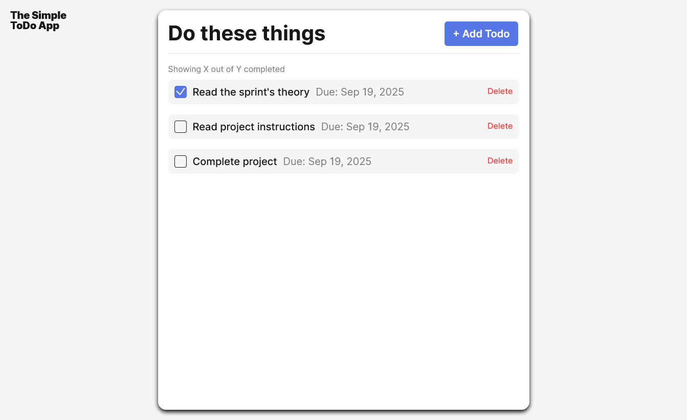

# Simple Todo App

This page is designed to be a little helper for you, a simple space where you can create a To-do list.

## Functionality

Tasks can be added via the "Add Todo" button, a form will appear asking you what your task is as well as the due date of that task. When you complete your task, the checkbox can be clicked to cross the item off your list.

## Technology

Give a description of the technologies and techniques used. Pictures, GIFs, or screenshots that detail the project features are recommended.
</img>

## Deployment

This project is deployed on GitHub Pages:

- (https://scarylyn.github.io/se_project_todo-app/)
